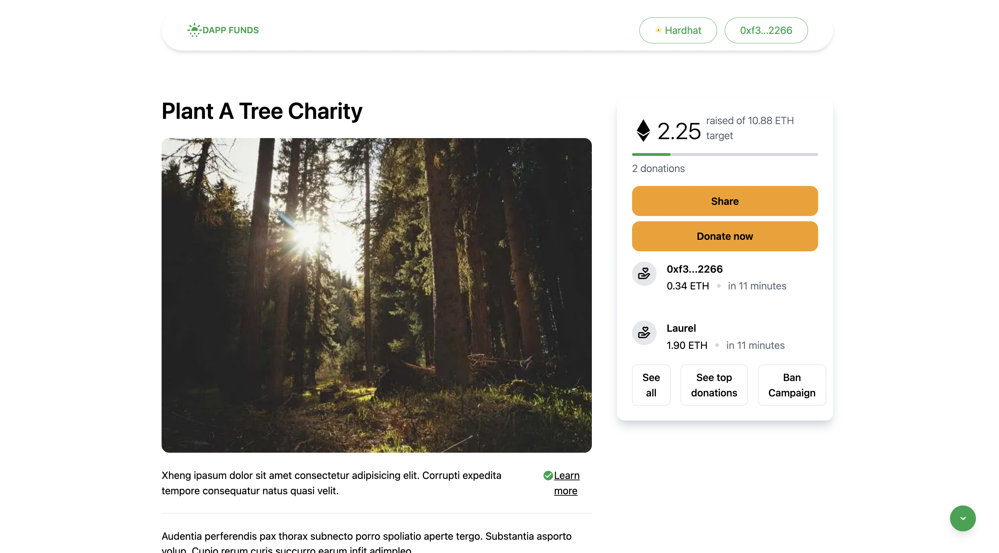

# DappFundsX Project Documentation

<!-- Read the full tutorial here: **[>> How to build a Decentralized Event Marketplace with Next.js, TypeScript, Tailwind CSS, and Solidity](https://daltonic.github.io)** -->


The `DappFund.sol` project is a Solidity-written Ethereum smart contract that serves as the backbone of a decentralized application (dApp) for charity purposes. It leverages the OpenZeppelin library to ensure secure and standardized development of the contract.


The contract is designed around two primary structures: CharityStruct and SupportStruct, representing a charity and a supporter, respectively.

## Key features:

- createCharity: Allows a user to create a new charity.
- updateCharity: Allows the charity owner to update the details of an existing charity.
- deleteCharity: Allows the charity owner or contract owner to delete a charity.
- toggleBan: Allows the contract owner to ban or unban a charity.
- donate: Allows a user to donate to a charity.
- changeTax: Allows the contract owner to change the tax percentage.
- getCharity: Returns a single charity by its ID.
- getCharities: Returns all existing charities.
- getMyCharities: Returns all charities created by the caller.
- getSupports: Returns all supporters for a specific charity.

## Running the Application

Supply the following keys in your `.env` variable:

```sh
NEXT_PUBLIC_RPC_URL=http://127.0.0.1:8545
NEXT_PUBLIC_ALCHEMY_ID=<YOUR_ALCHEMY_PROJECT_ID>
NEXT_PUBLIC_PROJECT_ID=<WALLET_CONNECT_PROJECT_ID>
NEXTAUTH_URL=http://localhost:3000
NEXTAUTH_SECRET=somereallysecretsecret
```

`YOUR_ALCHEMY_PROJECT_ID`: [Get Key Here](https://dashboard.alchemy.com/)
`WALLET_CONNECT_PROJECT_ID`: [Get Key Here](https://cloud.walletconnect.com/sign-in)

Follow these steps to run the application:

1. Install the package modules by running the command: `yarn install`
2. Start the Hardhat server: `yarn blockchain`
3. Run the contract deployment script: `yarn deploy`
4. Run the contract seeding script: `yarn seed`
5. Spin up the Next.js development server: `yarn dev`

Now, your application should be up and running.

## 📚 Key Technologies

- 🌐 Next.js: A React framework for building server-side rendered and static websites.
- 📘 TypeScript: A statically typed superset of JavaScript.
- 📦 Hardhat: A development environment for Ethereum smart contracts.
- 🌐 EthersJs: A library for interacting with Ethereum and Ethereum-like blockchains.
- 📚 Redux-Toolkit: A library for managing application state.
- 🎨 Tailwind CSS: A utility-first CSS framework.
- 🌈 @rainbow-me/rainbowkit-siwe-next-auth: A library for authentication in Ethereum dApps.
- 📝 React-Toastify: A library for adding toast notifications to your React application.
- 📜 Swiper: A modern mobile touch slider.
- 📚 Wagmi: A library for building Ethereum dApps.

## Useful links

- 🏠 [Website](https://dappmentors.org/)
- ⚽ [Metamask](https://metamask.io/)
- 💡 [Hardhat](https://hardhat.org/)
- 📈 [Alchemy](https://dashboard.alchemy.com/)
- 🔥 [NextJs](https://nextjs.org/)
- 🎅 [TypeScript](https://www.typescriptlang.org/)
- 🐻 [Solidity](https://soliditylang.org/)
- 👀 [EthersJs](https://docs.ethers.io/v5/)